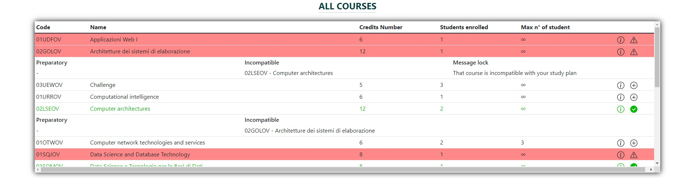
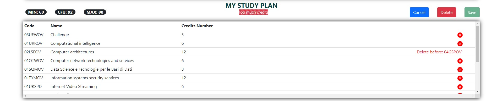
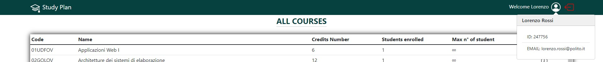
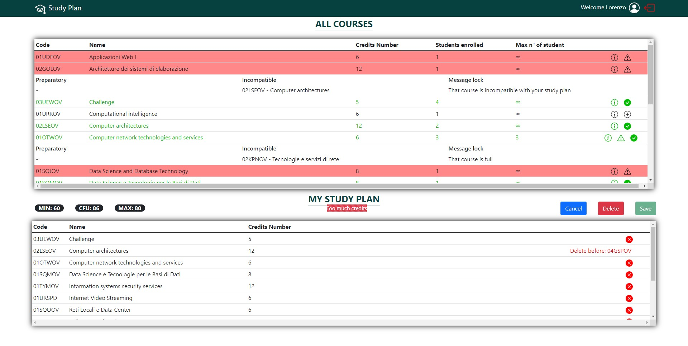

# Exam #1: "Study Plan"
## Student: s304903 BUOMPANE LORENZO 

## React Client Application Routes

### Route `/`: VIEW PAGE 
- Not logged in: Courses Table
- Logged in: Courses Table, Selection Type Form if a study plan not exists, otherwise Study Plan Table
- "Read-Only" study plan

### Route `/edit`: EDIT PAGE
- Route access for only logged in user
- Courses Table on top
- MIN, current, MAX CFU
- Button for cancel (changes not apply), save, delete (remove current and previus study plan)
- Study Plan Table on bottom
- User can update (or delete) the plan

### Route `/login`: LOGIN PAGE
- Form for the login

### Route `/*`: ERROR PAGE

<br>

## API Server

### __POST `/api/login`__
* Description: Authenticate the user
* Request params: _None_
* Request body:
```json
{
	"username" : "lorenzo.rossi@polito.it",
	"password" : "password"
}
```
* Response: `200 OK`(success)
* Response body: _None_

### __POST `/api/logout`__
* Description: Logout of logged user
* Request params: _None_
* Request body: _None_
* Response: `200 OK`(success) or `400 Bad Request` (not authenticated)
* Response body: _None_

### __GET `/api/v1/`__
* Description: Return the list of all courses
* Request params: _None_
* Request body: _None_
* Response: `200 OK`(success) or `500 Internal Server Error` (generic error) or `400 Bad Request` (not authenticated)
* Response body:
```json
[
    {
        "id": "02GOLOV",
        "name": "Architetture dei sistemi di elaborazione",
        "creditsNumber": 12,
        "studentsNumberMAX": null,
        "studentsNumber": 2,
        "preparatoryCourse": null,
        "incompatibleCourses": [
            "02LSEOV"
        ],
        "followingCourse": "05BIDOV"
    },
    ...
]
```

### __GET `/api/v1/studyplan`__
* Description: Return study plan of logged in user
* Request params: _None_
* Request body: _None_
* Response: `200 OK`(success) or `500 Internal Server Error` (generic error) or `400 Bad Request` (not authenticated)
* Response body:
```json
[
    "01OUZPD",
    "01SQJOV",
    "01SQOOV",
    "01TXSOV",
    "01TXYOV",
    "01UDUOV",
    "01URSPD",
    "02GRSOV",
    "02LSEOV"
]
```

### __GET `/api/v1/range`__
* Description: Return list of available study plan type
* Request params: _None_
* Request body: _None_
* Response: `200 OK`(success) or `500 Internal Server Error` (generic error)
* Response body:
```json
[
    {
        "id": 0,
        "name": "Full Time",
        "min": 60,
        "max": 80
    },
    {
        "id": 1,
        "name": "Part Time",
        "min": 20,
        "max": 40
    }
]
```

### __GET `/api/v1/course/:course/studentEnrolled`__
* Description: Return number of students enrolled on the selected course
* Request params: _course_ - selected course
* Request body: _None_
* Response: `200 OK`(success) or `500 Internal Server Error` (generic error)
* Response body:
```json
{
    "studEnr": 2
}
```

### __GET `/api/v1/user`__
* Description: Return logged in user information 
* Request params: _None_
* Request body: _None_
* Response: `200 OK`(success) or `500 Internal Server Error` (generic error) or `400 Bad Request` (not authenticated)
* Response body:
```json
{
    "id": "247756",
    "name": "Lorenzo",
    "surname": "Rossi",
    "email": "lorenzo.rossi@polito.it",
    "type": 1
}
```

### __POST `/api/v1/studyplan`__
* Description: Create (if valid) a new study plan of logged in user
* Request params: _None_
* Request body:
```json
{
    "studyplan": [
        "01OUZPD",
        "01SQJOV",
        "01SQOOV",
        "01TXSOV",
        "01TXYOV",
        "01UDUOV",
        "01URSPD",
        "02GRSOV",
        "02LSEOV"
    ],
    "type": 1
}
```
* Response: `201 Created`(success) or `422 Unprocessable Entity` (invalid study plan) or `500 Internal Server Error` (generic error) or `400 Bad Request` (not authenticated)
* Response body:
```json
{
    "valid": true	
}
```

### __PUT `/api/v1/type`__
* Description: Update study plan type of logged in user
* Request params: _None_
* Request body:
```json
{
    "type": 1	
}
```
* Response: `200 OK`(success) or `500 Internal Server Error` or `400 Bad Request` (not authenticated)
* Response body: _None_

### __PUT `/api/v1/course/:course/studentEnrolled`__
* Description: Update number of students enrolled on the selected course
* Request params: _course_ - selected course
* Request body:
```json
{
    "studEnr": 2	
}
```
* Response: `200 OK`(success) or `500 Internal Server Error`
* Response body: _None_

### __PUT `/api/v1/studyplan`__
* Description: Update (if valid) an existing study plan of logged in user
* Request params: _None_
* Request body:
```json
{
    "studyplan": [
        "01OUZPD",
        "01SQJOV",
        "01SQOOV",
        "01TXSOV",
        "01TXYOV",
        "01UDUOV",
        "01URSPD",
        "02GRSOV",
        "02LSEOV"
    ],
    "type": 1
}
```
* Response: `200 OK`(success) or `422 Unprocessable Entity` (invalid study plan) or `500 Internal Server Error` (generic error) or `400 Bad Request` (not authenticated)
* Response body:
```json
{
    "valid": true		
}
```

### __DELETE `/api/v1/studyplan`__
* Description: Delete persistency study plan of logged in user
* Request params: _None_
* Request body: _None_
* Response: `204 No Content` (success) or `500 Internal Server Error` (generic error)
* Response body: _None_

<br>

## Database Tables
**Bold**: primary key
<br>
*Italic*: foreign key

### Table `Courses`
- **id** 
- name
- creditsNumber
- studentsNumberMAX 
- studentsNumber
- *preparatoryCourse*


Each row contains the informations of a single course

### Table `IncompatibleCourses`: Incompatible courses list
- ***courseId***
- ***incompatibleCourseId***

Each row contains a course with its incompatible one 

### Table `PlanTypes`: 
- **id**
- name
- creditsMIN
- creditsMAX

Each row contains a specific type of study plan

### Table `Plans`
- ***studentId***
- ***courseId***

Each row contains a student and a course: the student is enrolled to that course

### Table `Students`
- **id**
- name
- surname
- email
- *type*
- salt
- hash
  
Each row contains the information of a student 

## Main React Components

### `CoursesTable` (in `coursesTable.js`)
- All courses table
- A course with its description (code, name, credits number, number of students enrolled, maximum number of students) in each row
- Expand button with some other information (preparatory and incompatible courses)
- In edit mode each row has also an add button, if course is in study plan, text color of row is green
- If cannot insert the course in study plan, the row is highlined in red and if the row was expanded, a message lock is appeared



### `StudyPlanTable` (in `studyPlanTable.js`)
- All courses in study plan with code, name and credits number
- Remove course button on the right
- If the course is preparatory for another course in study plan, delete button is removed and "Delete before: {course name}" text appears (highlined in red)
- On top of Study Plan Table (if exist study plan) are rendering: 
  - _view mode_: current CFU and edit button
  - _edit mode_: MIN, current, MAX CFU, alert if the current CFUs are not in the range, Cancel (remove last changes in study plan), Save (study plan), Delete (remove local and persistency copy of study plan) buttons 



### `LoginForm` (in `loginForm.js`)
- Simply form for the login
- Must insert email and password
- Button login and back to view homepage


### `SelectTypePlan` (in `App.js`)
- Must select the type of study plan that the user wants
- After the selection, you must click on the button


### `NavigationBar` (in `App.js`)
- In navigation bar there is a logo on the left
- On the right, login button if user not authenticated
- Otherwise, there is the "Welcome {name}" text and logout button
- If user is logged, after clicking on user icon, user information (name, surname, id, email) is appeared



## Screenshot



## Users Credentials

|   id   |  name   | surname |          email           | password(not saved in db) |     type      |
| :----: | :-----: | :-----: | :----------------------: | :-----------------------: | :-----------: |
| 247756 | Lorenzo |  Rossi  | lorenzo.rossi@polito.it  |         password          |   Full Time   |
| 263243 |  Marco  | Gialli  |  marco.gialli@polito.it  |         password          |   Part Time   |
| 274639 | Giacomo |  Verdi  | giacomo.verdi@polito.it  |         password          |   Part Time   |
| 254364 | Simone  |   Blu   |   simone.blu@polito.it   |         password          |   Full Time   |
| 236346 |  Paolo  | Arancio | paolo.arancio@polito.it  |         password          | No study plan |
| 264355 | Chiara  | Bianchi | chiara.bianchi@polito.it |         password          | no study plan |

- username for login is email
- Computer network technologies and services FULL COURSE
- Internet Video Streaming FULL COURSE
